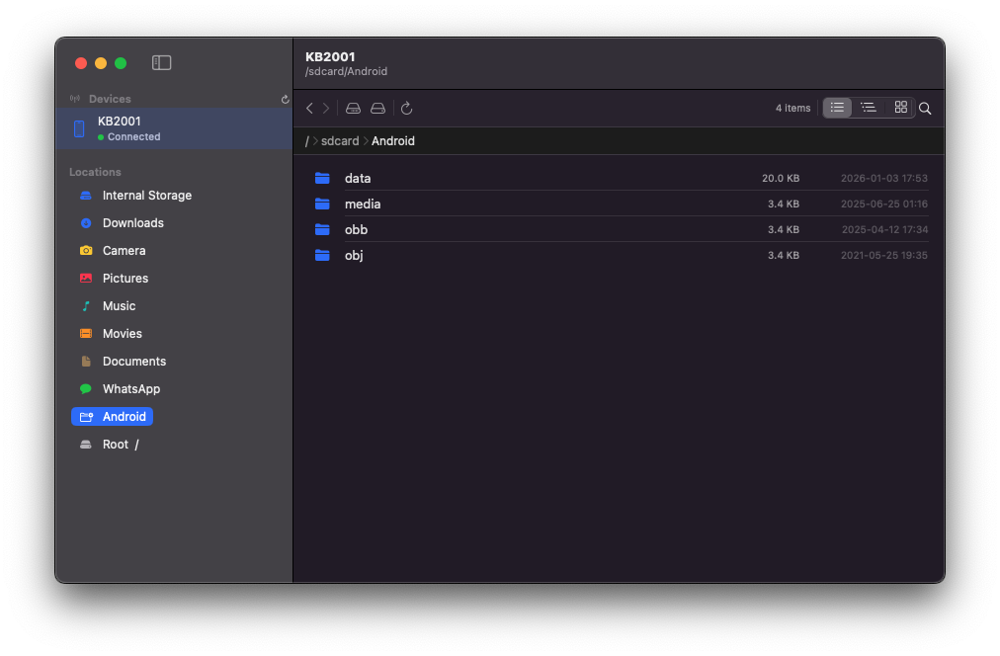

# DroidDuck - Mac File Client for Android 

A native macOS file explorer for connected Android devices, built with Swift and SwiftUI. Browse, preview, and download files from your Android phone or tablet directly from your Mac — no third-party apps required.



---

## Features

### Device Management
- Auto-detects connected Android devices via ADB (Android Debug Bridge)
- Polls every 3 seconds for device connect / disconnect events
- Displays device model name and connection status (Connected, Unauthorized, Offline, Recovery)
- Prompts to authorize USB debugging when a device is Unauthorized
- Auto-installs ADB via Homebrew if not found, with a live streaming install log

### File Browser
- Starts in `/sdcard` (Internal Storage) by default — just like other Android file explorers
- Full back / forward navigation history
- Breadcrumb bar showing the current path with clickable segments
- Refresh with ⌘R
- Item count displayed in the toolbar
- System files marked with a lock badge and muted colour so they stand out

### Three View Modes

**List View** — Classic compact rows with file name, size, and date columns. Sorted directories-first, then alphabetically.

**Tree View** — Expandable directory tree. Children are loaded lazily on first expand. Collapse all with one click.

**Card View** — Square grid of cards. Image files (JPG, PNG, HEIC, WEBP, GIF, BMP, TIFF) display a live thumbnail pulled from the device. Other file types show a large colour-coded icon with an extension badge. Thumbnails load lazily as cards scroll into view, with a max of 4 concurrent downloads.

### Locations Sidebar
Quick-jump links to the most-used Android paths:
- Internal Storage (`/sdcard`)
- Downloads, Camera, Pictures, Music, Movies, Documents
- WhatsApp folder
- Android data folder
- Root (`/`)

### File Search
- ⌘F to activate, Esc to dismiss
- Debounced (400 ms) — no ADB spam on every keystroke
- Searches the current directory recursively via `adb shell find`
- Results grouped directories-first, each showing its parent path
- Right-click on any result for the full context menu

### Image Preview
Double-click any image file to open DroidDuck's built-in preview without leaving the app:
- Smooth scroll-wheel / trackpad zoom
- Double-click image to toggle Fit ↔ Actual Size (100%)
- Zoom In / Out buttons with live percentage readout
- Copy image to clipboard
- Reveal temp file in Finder
- Image dimensions shown (e.g. 4032 × 3024 px)

### Open in System App
Right-click any supported file → **Open in System App** to pull the file and open it in the macOS default handler:

| Type | Opens In |
|---|---|
| Images (JPG, PNG, HEIC, WEBP…) | Preview / Photos |
| PDF | Preview |
| Audio (MP3, AAC, FLAC, WAV…) | Music / QuickTime |
| Video (MP4, MOV, MKV, AVI…) | QuickTime Player |
| Text / Code (TXT, JSON, Swift, Python…) | TextEdit / default editor |
| Documents (DOCX, Pages, ODT) | Pages / Word |
| Spreadsheets (XLSX, Numbers, ODS) | Numbers / Excel |

A status banner slides up from the bottom of the window while the file is downloading, with an error state that auto-dismisses after 5 seconds.

### Download to Mac
Right-click any file → **Download to Mac** to save it to your `~/Downloads` folder. Automatically renames the file if one with the same name already exists. Reveals the saved file in Finder when done.

### Context Menu (right-click any file or folder)
- Quick Preview (images)
- Open in System App
- Download to Mac
- Copy Path / Copy Name
- Get Info (full metadata sheet: permissions, owner, group, size, date, symlink target)
- Rename *(coming soon)*
- Delete *(coming soon)*

### Diagnostics
**Help → Diagnostics** (⌘⌥D) shows a colour-coded report:
- macOS version
- App Sandbox status
- Homebrew path
- ADB binary path and version
- ADB daemon status
- Connected devices
- Common path accessibility scan

---

## Requirements

| | |
|---|---|
| **macOS** | 13 Ventura or later |
| **Xcode** | 15 or later |
| **ADB** | Installed automatically via Homebrew, or manually |
| **Android device** | USB debugging enabled |

### Enable USB Debugging on Android
1. Go to **Settings → About Phone**
2. Tap **Build Number** 7 times to unlock Developer Options
3. Go to **Settings → Developer Options**
4. Enable **USB Debugging**
5. Connect via USB and tap **Allow** when prompted on the device

---

## Installation

### 1. Clone the repository
```bash
git clone https://github.com/greenSyntax/droid-duck-mac.git
cd DroidDuck
```

### 2. Open in Xcode
```bash
open DroidDuck/DroidDuck.xcodeproj
```

### 3. Disable App Sandbox (required for ADB subprocess)
In Xcode, select the **DroidDuck** target → **Signing & Capabilities** → remove the **App Sandbox** capability. Without this, macOS will block the ADB subprocess from running.

### 4. Build & Run
Select your Mac as the run destination and press ⌘R.

### ADB Setup
DroidDuck looks for ADB in these locations in order:
1. `/opt/homebrew/bin/adb` (Homebrew, Apple Silicon)
2. `/usr/local/bin/adb` (Homebrew, Intel)
3. `~/Library/Android/sdk/platform-tools/adb` (Android Studio)
4. `~/Android/sdk/platform-tools/adb`
5. `/usr/bin/adb`
6. Output of `which adb` (covers custom PATH entries)

If ADB is not found and Homebrew is installed, DroidDuck offers to install it automatically. If Homebrew is not installed, the empty state shows manual install instructions.

**Manual install:**
```bash
# Homebrew (recommended)
brew install --cask android-platform-tools

# Or download platform-tools directly from Google:
# https://developer.android.com/tools/releases/platform-tools
```

---

## Project Structure

```
DroidDuck/
├── DroidDuckApp.swift          # App entry point, menus
├── Models/
│   ├── DeviceInfo.swift        # Device model + status enum
│   └── FileNode.swift          # File/folder model, ls parser, openable categories
├── Services/
│   ├── ADBService.swift        # ADB actor: list devices, list directory, pull, search
│   └── DeviceManager.swift     # Device polling, Homebrew install orchestration
├── ViewModels/
│   └── FileBrowserViewModel.swift  # Navigation, search, tree, thumbnails, open/download state
└── Views/
    ├── ContentView.swift           # NavigationSplitView root
    ├── Sidebar/
    │   └── DeviceSidebarView.swift # Devices + Locations panel
    ├── Browser/
    │   ├── FileBrowserView.swift   # Toolbar, breadcrumbs, search bar, content routing
    │   ├── FileRowView.swift       # List view row
    │   ├── TreeBrowserView.swift   # Tree view + TreeRowView
    │   ├── CardBrowserView.swift   # Card grid + thumbnail loading
    │   └── ImagePreviewView.swift  # Full image preview sheet
    └── Shared/
        ├── DiagnosticsView.swift   # Diagnostics report sheet
        ├── EmptyStateView.swift    # No-ADB / no-device empty state
        └── FileActionBanner.swift  # Download / open status banner
```

---

## Keyboard Shortcuts

| Shortcut | Action |
|---|---|
| ⌘R | Refresh current directory |
| ⌘[ | Go back |
| ⌘] | Go forward |
| ⌘F | Activate search |
| Esc | Dismiss search |
| ⌘⇧R | Refresh device list |
| ⌘⌥D | Open Diagnostics |

---

## Known Limitations

- **Write operations** (rename, delete, new folder) are not yet implemented
- **APK installation** is not yet supported
- Directories cannot be downloaded as a zip (file-only download for now)
- Very large video files may take a while to pull before opening in QuickTime

---

## License

MIT License. See [LICENSE](LICENSE) for details.
